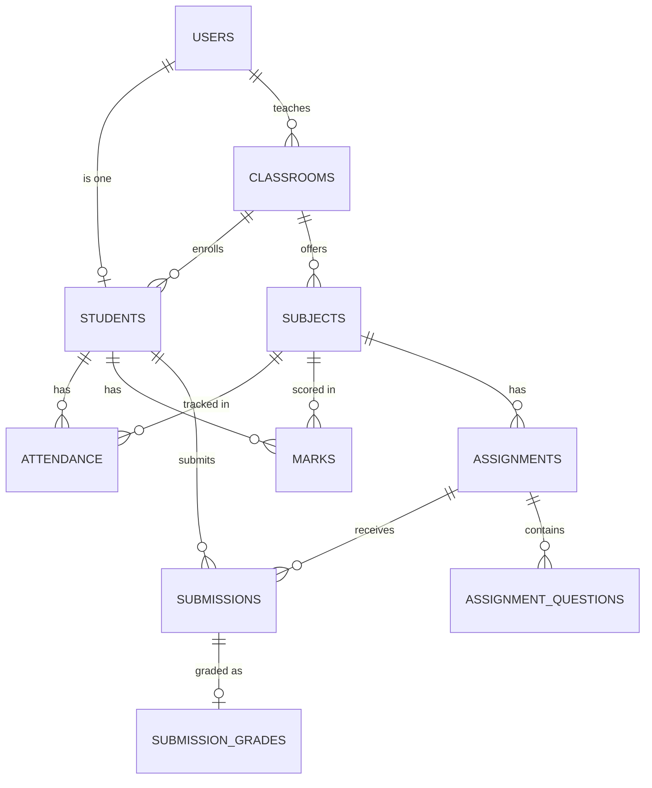

# EduTrack Pro — the study guide

You know Python and React already. This doc is only about the *libraries* stitching them together, and the *pipelines* (feature flows) in your actual codebase. Read part 1 once, then use part 2 + 3 as your notebook reference while you go file by file.

---

## Part 1 — the vocabulary you're missing

### The core idea: two separate programs that talk over HTTP

Your project is actually **two independent programs**:
- The **backend** (`backend/`) — a Python program that only knows how to answer questions like "give me the attendance list" or "save this mark." It has no idea what a button or a screen looks like.
- The **frontend** (`frontend/`) — a React program that runs in the user's browser. It has no idea how a database works. It just draws screens and asks the backend for data.

They talk to each other the exact same way your browser talks to any website: **HTTP requests**. The frontend sends a request like `POST /api/v1/attendance` with some JSON data, the backend sends back a JSON response. That's the entire relationship. Neither side can see the other's code — they only agree on the *shape* of the JSON they exchange.

This is why it's called "full stack": you're not writing one program, you're writing two programs plus the contract between them.

### Backend libraries (Python side)

| Library | What it actually is | Plain analogy |
|---|---|---|
| **FastAPI** | A framework that turns Python functions into HTTP endpoints. `@router.get("/students")` means "when someone visits this URL, run this function." | Like `if __name__ == "__main__"` but instead of one entry point, you get one entry point *per URL*. |
| **Uvicorn** | The actual program that listens on port 8000 and hands incoming requests to FastAPI. FastAPI is just code — Uvicorn is what makes it a running server. | The `python app.py` that keeps a program alive and listening, except purpose-built for handling many requests at once. |
| **SQLAlchemy** | An ORM (Object-Relational Mapper). Lets you write `Attendance(student_id=1, status="Present")` and `db.add(record)` instead of writing raw `INSERT INTO attendance ...` SQL by hand. Every class in `app/models/` is a Python class that SQLAlchemy quietly turns into a database table. | Treats database rows as regular Python objects with attributes, instead of you writing SQL strings everywhere. |
| **Pydantic** | Data validation using Python type hints. Every class in `app/schemas/` (like `AttendanceCreate`) defines exactly what fields a request must have and what type they must be. If the frontend sends garbage, Pydantic rejects it *before* your code runs. | Like writing `assert isinstance(x, int)` for every field of every request, automatically, from a class definition. |
| **Alembic** | Tracks changes to your database structure over time (migrations) — e.g. "add a `phone` column to students." Lets you evolve the DB schema without deleting and recreating it. | Git, but for database table structure instead of code. |
| **python-jose** | Creates and reads JWTs (see below). | The library that actually does the signing/verifying math for your login tokens. |
| **passlib / bcrypt** | Hashes passwords so the real password is never stored anywhere, even in the database. | One-way scrambling — you can check "does this password match the hash" but you can never reverse a hash back into the password. |
| **pandas / openpyxl** | Used for building Excel exports/reports in this project. | Same pandas you already know from data work — DataFrames, `.to_excel()`. |

### Frontend libraries (React side)

| Library | What it actually is | Plain analogy |
|---|---|---|
| **Vite** | The tool that runs your React app in dev mode (`npm run dev`) and bundles it into static files for production (`npm run build`). | Like `python -m http.server` but with hot-reload and a build step. |
| **axios** | A library for making HTTP requests from JavaScript, like Python's `requests` library. `axios.post(url, data)` ≈ `requests.post(url, json=data)`. | Exactly `requests`, just in JS, living in `frontend/src/services/api.js`. |
| **react-router-dom** | Lets a single-page app have multiple "pages" (`/dashboard`, `/students`, `/attendance`) without actually reloading the browser. | Simulates multi-page navigation inside one HTML page. |
| **recharts** | The charting library used for your dashboard graphs (bar charts, line charts). | Like matplotlib, but renders directly in the browser as interactive SVG. |
| **lucide-react** | Just an icon pack. Not architecturally important. | Clip-art, basically. |
| **react-toastify** | Those little popup notifications ("Attendance saved!"). | Print statements, but as UI. |

### The three-letter words that matter

- **API** — Application Programming Interface. In this project it specifically means: the list of URLs your backend exposes (`/api/v1/students`, `/api/v1/attendance`, etc.) and what JSON they expect/return. Visit `http://localhost:8000/docs` while the backend is running — FastAPI auto-generates a full interactive list of every API endpoint in your project. **Bookmark this page**, it's the best map of your own backend.
- **JWT** (JSON Web Token) — a signed string that proves "this user logged in and is who they say they are," without the server having to remember anything. It has three parts (`header.payload.signature`), and the payload contains your `user_id`, `email`, `role`, and an expiry time. Because it's *signed* (not encrypted), the backend can verify nobody tampered with it, using the same `SECRET_KEY` it signed it with.
- **REST** — the *style* your API follows: URLs represent things (`/students`, `/attendance/5`), and the HTTP method says what to do to them (`GET` = read, `POST` = create, `PUT` = update, `DELETE` = remove). This is why you see the same 5 methods repeated in every router.
- **ORM** — see SQLAlchemy above. The layer that turns Python objects into SQL and back.
- **Middleware** — code that runs on *every* request before it reaches your endpoint. Your `CORSMiddleware` in `main.py` is one: it's what allows your React app (running on `localhost:5173`) to even be allowed to talk to your backend (running on `localhost:8000`) — browsers block cross-origin requests by default unless the server explicitly allows it.
- **Dependency injection (`Depends(...)`)** — FastAPI's way of saying "before running this function, run this other function first and hand me its result." This is how `get_current_user` and `get_db` sneak into every route without you writing auth-checking code in every single function.

---

## Part 2 — the project's shape

```
backend/app/
  main.py          <- starts the app, registers all routers, sets up CORS
  core/            <- config, security (JWT + hashing), dependencies (auth guards)
  database/        <- DB connection setup, seed script
  models/          <- SQLAlchemy classes = your DB tables
  schemas/         <- Pydantic classes = your request/response shapes
  routers/         <- one file per feature, defines the URLs
  services/        <- one file per feature, has the actual business logic
  exceptions/      <- custom error types + handlers that turn them into HTTP responses
  utils/           <- pagination, response formatting helpers

frontend/src/
  pages/           <- one folder per feature, the actual screens
  components/      <- reusable UI pieces (tables, cards, charts)
  services/        <- one file per feature, axios calls (mirrors backend routers 1:1)
  context/         <- shared state, e.g. "who is the logged-in user"
  routes/          <- maps URLs like /dashboard to which page component renders
```

Notice: `routers/attendance.py` ↔ `services/attendanceService.js` — the backend and frontend are organized by the exact same feature list, on purpose. When you're lost, find the matching pair of files and read them side by side.

### Your data model (the tables)



Every one of your 11 models in `app/models/` maps to one box here. `User` is the login identity (email + password + role); `Student` is a *separate* row with extra academic fields (roll number, department) linked to a `User` — that split exists because teachers are `Users` too but don't need student-only fields.

---

## Part 3 — every pipeline, the same pattern, 8 times

Every feature in this app follows **the exact same 6-step shape**. Once this clicks, you understand the whole backend, not just one feature.

```
1. React page          -> user clicks a button / submits a form
2. frontend service.js -> axios call to a specific URL + HTTP method
3. FastAPI dependency   -> get_current_user (+ require_teacher/require_student) runs first
4. router.py            -> receives validated data (Pydantic already checked it), calls the service
5. service.py           -> actual logic: validation, queries, calculations
6. models.py + DB        -> SQLAlchemy reads/writes rows, response flows back up
```

Here's that pattern applied to every pipeline in your app. For each, I list: the URL(s), which file has the logic, and the one thing that makes that pipeline *not* just boilerplate.

### 1. Auth — `routers/auth.py` + `services/auth_service.py`
`POST /auth/login`, `GET /auth/me`. The only pipeline that *doesn't* require a token going in — its whole job is to *produce* one. Logic: look up user by email → `verify_password()` (bcrypt compare) → `create_access_token()` (JWT sign). Everything else in the app depends on this pipeline having already run.

### 2. Students — `routers/students.py` + `services/student_service.py`
Standard CRUD (`GET/POST/PUT/DELETE /students`). Worth noting: `StudentService.ensure_access()` is called from *other* pipelines (attendance, marks) to check "is this the student's own record, or is the requester a teacher?" — access control that's reused, not duplicated.

### 3. Classrooms & Subjects — `routers/classrooms.py`, `routers/subjects.py`
Simple CRUD, teacher-only for writes. These exist mostly as the "parent" tables that attendance/marks/assignments hang off of.

### 4. Attendance — `routers/attendance.py` + `services/attendance_service.py`
The richest pipeline. Beyond plain CRUD it has: `mark_bulk` (mark a whole classroom's attendance in one request — used by the "attendance sheet" UI), `percentage()` (present ÷ total), and `at_risk_students()` (loops every student, flags anyone under a threshold like 75%). A `UniqueConstraint` on `(student_id, subject_id, attendance_date)` in the model stops the same student being marked twice for one day at the database level — not just in Python.

### 5. Marks — `routers/marks.py`
Same CRUD shape as attendance. `average/{student_id}` computes a student's mean score. This is what feeds "average_marks" on the dashboard.

### 6. Assignments & Submissions — `routers/assignments.py`, `routers/submissions.py`
Two linked pipelines: teachers create assignments (with `assignment_question.py` sub-items), students submit answers, and `submission_grade.py` stores the teacher's grading afterward. This is the closest thing in the app to a real one-to-many-to-one chain (assignment → many submissions → one grade each).

### 7. Dashboard — `routers/dashboard.py` + `services/dashboard_service.py`
Not CRUD at all — purely read/aggregate. `teacher_dashboard()` and `student_dashboard()` each call into the *other* services (attendance, marks, students) and squash their outputs into one summary dict. This is the pipeline that proves the service layer split was worth it: dashboard doesn't duplicate logic, it just calls `AttendanceService.percentage()` etc. and combines results.

### 8. Reports — `routers/reports.py`
Six read-only endpoints (`/student/{id}`, `/attendance`, `/marks`, `/assignments`, `/performance`, `/institution`) that assemble bigger cross-feature summaries, similar spirit to the dashboard but more detailed — this is what your Excel/PDF exports likely pull from.

---

## How to actually study this with your notebook

For each pipeline above, pick one endpoint and trace it top to bottom in the real files:
1. Open the frontend page, find the button, find what service function it calls.
2. Open that `services/*.js` file, note the exact URL + HTTP method.
3. Open the matching backend router, find that URL, see which `Depends()` guards it and which service function it calls.
4. Open the service function, read every line — this is where the actual "why" lives.
5. Open the model it touches, note the columns and any `ForeignKey`/`UniqueConstraint`.

Do that once fully (attendance is the best one — most logic) and the rest will read fast, because they're the same shape with different field names.
